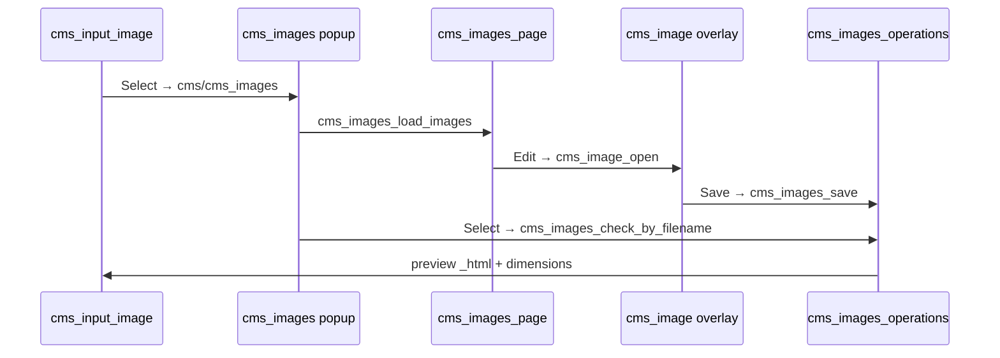

# cms_input_image panel

Panel: `cms/cms_input_image`

## Purpose

Admin form control for selecting a CMS image or video. Stores the filename in a hidden input (`img/path/file.jpg`); shows a live preview and **Select** / **Clear** buttons.

Used on page panels, SEO fields, xy/mask pickers (as target image source).

## Template / UI

[`cms_input_image.tpl.php`](../templates/cms_input_image.tpl.php):

- `cms_input_image_container` → `cms_input_image_area_{name_clean}` → `cms_input_image_content_{name_clean}`
- Preview: `_ib($value, 300)` inside `.cms_input_image_image`
- Hidden input: `.cms_input_image_input` / `.cms_image_input_{name_clean}`
- **normal** size — tall preview area; **small** — compact, hover expands overlay
- `readonly` — hides Select/Clear; `category` — passed to selector category filter
- Missing file — `.cms_input_image_error` (video children with valid parent are exempt)

## Selector stack

| Step | Function / panel |
|------|------------------|
| Open popup | `cms_input_image_popup()` → `cms_input_image_load_images()` → `panels_display_popup` |
| Grid load | `cms_images_load_images()` — paging, search, category, upload |
| Grid videos | `cms_video_init_when_ready($('.cms_images_area'))` after ajax |
| Edit | `cms_image_open(filename)` — second overlay on grid |
| Select | `cms_input_image_apply_selection()` → `cms_images_check_by_filename` |
| Cancel | Refresh preview if editor changed file; else `cms_input_image_resume_preview_videos()` |

Popup reopen — if grid still shows "Loading ...", `cms_input_image_load_images` triggers `cms_images_load_images` on the new popup instance.

## Apply selection

`cms_images_operations` `cms_images_check_by_filename` returns:

- `_html` — preview markup (`cms_images_operations.tpl.php` → `_ib` at 300px)
- `filename`, `original_width`, `original_height`
- meta fields (`author`, `copyright`, …) for linked `.cms_meta` inputs (xy/mask pickers)

Sets `data-w` / `data-h` on `.cms_input_image` for downstream tools. Mp4 previews call `cms_video_init_when_ready` on the content container.

## Controller

[`cms_input_image.php`](../panels/cms_input_image.php) `panel_params`:

- `name_clean` — CSS class suffix when `name` has special chars
- Module defaults (`module/file`) — copy from `modules/{module}/img/` into uploads + `create_cms_image` on first render
- Missing-file check — skip for video child when `get_video_view_meta()` resolves parent with mp4/fallback
- Preloads `cms_media_view.js`, `cms_video.js`, `cms_video_view.scss` for mp4 previews

## JS conventions

[`cms_input_image.js`](../js/cms_input_image.js):

- `cms_input_image_init()` — bind once per container (`data('cms_initiated')`)
- Params: `input_selector`, `container_selector`, `category`, `path_type` (`img` or `root`), `after` callback
- `cms_input_image_rename(old_name)` — when duplicating page panels, renames class suffixes

## Related panels

| Panel | Role |
|-------|------|
| `cms/cms_images` | Popup shell + toolbar |
| `cms/cms_images_page` | Grid cells (ajax) |
| `cms/cms_image` | Crop / adjust editor overlay |
| `cms/cms_images_operations` | check, save, delete |
| `cms/cms_images_upload` | Upload; mp4 → encode queue |

## Files

| Role | Path |
|------|------|
| Controller | `modules/cms/panels/cms_input_image.php` |
| Template | `modules/cms/templates/cms_input_image.tpl.php` |
| JS | `modules/cms/js/cms_input_image.js` |
| SCSS | `modules/cms/css/cms_input_image.scss` (via `cms_input.scss`) |

## See also

- [`cms_image.md`](cms_image.md) — crop editor UI and export model
- [`cms_video.md`](cms_video.md) — mp4 encode queue and playback
- [`agents.md`](agents.md) — compact image/video architecture rules